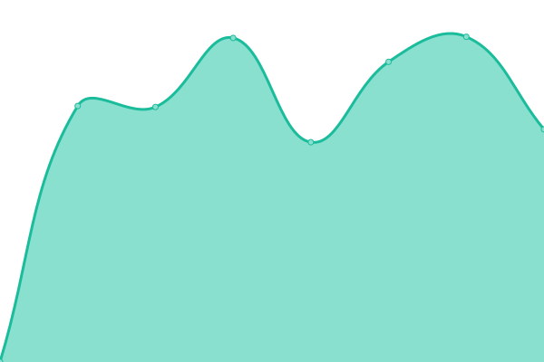

# [📈 Live Status](https://Xaradon.github.io/D4OStatus): <!--live status--> **🟩 All systems operational**

This repository contains the open-source uptime monitor and status page for [Xaradon](xaradon.de), powered by [Upptime](https://github.com/upptime/upptime).

With [Upptime](https://upptime.js.org), you can get your own unlimited and free uptime monitor and status page, powered entirely by a GitHub repository. We use [Issues](https://github.com/Xaradon/D4OStatus/issues) as incident reports, [Actions](https://github.com/Xaradon/D4OStatus/actions) as uptime monitors, and [Pages](https://Xaradon.github.io/D4OStatus) for the status page.

<!--start: status pages-->
<!-- This summary is generated by Upptime (https://github.com/upptime/upptime) -->
<!-- Do not edit this manually, your changes will be overwritten -->
<!-- prettier-ignore -->
| URL | Status | History | Response Time | Uptime |
| --- | ------ | ------- | ------------- | ------ |
|  [D4O Homepage](https://d4o.de) | 🟩 Up | [d4-o-homepage.yml](https://github.com/Xaradon/D4OStatus/commits/HEAD/history/d4-o-homepage.yml) | 

 771ms
     
 | 

<a href="https://Xaradon.github.io/D4OStatus/history/d4-o-homepage">100.00%</a>
    

|  [Accounting](https://accounting.d4o-free2play.de) | 🟩 Up | [accounting.yml](https://github.com/Xaradon/D4OStatus/commits/HEAD/history/accounting.yml) | 

 169ms
     
 | 

<a href="https://Xaradon.github.io/D4OStatus/history/accounting">100.00%</a>
    

|  [D4O Wiki](https://wiki.d4o.de/) | 🟩 Up | [d4-o-wiki.yml](https://github.com/Xaradon/D4OStatus/commits/HEAD/history/d4-o-wiki.yml) | 

 1783ms
     
 | 

<a href="https://Xaradon.github.io/D4OStatus/history/d4-o-wiki">100.00%</a>
    

|  [Support System](https://ticket.d4o.de/) | 🟩 Up | [support-system.yml](https://github.com/Xaradon/D4OStatus/commits/HEAD/history/support-system.yml) | 

 693ms
     
 | 

<a href="https://Xaradon.github.io/D4OStatus/history/support-system">100.00%</a>
    

<!--end: status pages-->

[**Visit our status website →**](https://Xaradon.github.io/D4OStatus)

## 📄 License

- Powered by: [Upptime](https://github.com/upptime/upptime)
- Code: [MIT](./LICENSE) © [Xaradon](xaradon.de)
- Data in the `./history` directory: [Open Database License](https://opendatacommons.org/licenses/odbl/1-0/)
